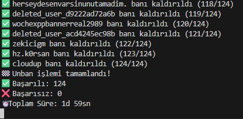
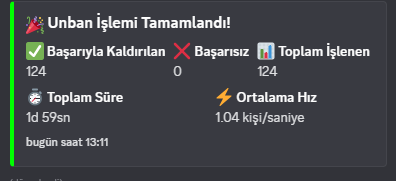
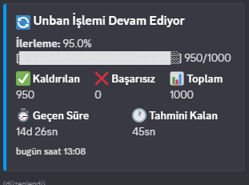

# Discord Mass Unban Bot

Discord sunucunuzda toplu ban kaldırma işlemleri için geliştirilmiş güçlü ve güvenli bot.

## 📸 Önizleme

### Komut Kullanımı


### Ban Durumu Kontrolü


### İşlem İlerlemesi


## 🚀 Özellikler

- ✅ **Toplu ban kaldırma** (/massunban) - Güvenlik onayı ile
- 📊 **Detaylı ban durumu** (/banstatus) - Gerçek zamanlı bilgi
- ⏹️ **Güvenli işlem durdurma** (/stopunban) - İstatistiklerle
- 🔄 **Rate limit koruması** - Discord API limitlerini aşmaz
- 📈 **Gerçek zamanlı takip** - İlerleme çubuğu ve ETA
- ❌ **Akıllı hata yönetimi** - Başarısız işlemler raporlanır
- 🎯 **Yetki kontrolü** - Sadece yetkili kullanıcılar erişebilir
- 📱 **Modern slash komutlar** - Kolay kullanım
- 🚫 **Çoklu işlem koruması** - Aynı anda sadece bir işlem
- ⚠️ **Detaylı uyarı sistemi** - Kullanıcı dostu bildirimler

## 📋 Gereksinimler

- Node.js v16.9.0 veya üzeri
- Discord.js v14
- Bot tokenı ve gerekli yetkiler

## 🛠️ Kurulum

1. **Bağımlılıkları yükleyin:**
   ```bash
   npm install
   ```

2. **Ortam değişkenlerini ayarlayın:**
   ```bash
   # .env.example dosyasını kopyalayın
   copy .env.example .env
   ```
   
   Ardından `.env` dosyasını düzenleyip kendi bilgilerinizi ekleyin:
   ```env
   DISCORD_TOKEN=your_actual_bot_token_here
   GUILD_ID=your_actual_guild_id_here
   UNBAN_DELAY=1000
   ENABLE_LOGGING=true
   ```

3. **Bot'u başlatın:**
   ```bash
   npm start
   ```

## 🤖 Bot Kurulumu

1. **Discord Developer Portal'da bot oluşturun:**
   - https://discord.com/developers/applications adresine gidin
   - "New Application" butonuna tıklayın
   - Uygulama adını girin (örn: "Mass Unban Bot")
   - "Bot" sekmesine geçin
   - "Add Bot" butonuna tıklayın
   - "Token" bölümünden bot tokenınızı kopyalayın
   - Bu token'ı `.env` dosyasındaki `DISCORD_TOKEN` kısmına yapıştırın

2. **Sunucu ID'sini alın:**
   - Discord'da Developer Mode'u açın (User Settings > Advanced > Developer Mode)
   - Sunucunuza sağ tıklayın ve "Copy Server ID" seçin
   - Bu ID'yi `.env` dosyasındaki `GUILD_ID` kısmına yapıştırın

3. **Gerekli yetkiler:**
   - `Ban Members` (Üyeleri Banla)
   - `Use Slash Commands` (Slash Komutları Kullan)

3. **Bot davet linki:**
   ```
   https://discord.com/api/oauth2/authorize?client_id=YOUR_BOT_ID&permissions=4&scope=bot%20applications.commands
   ```

## 📝 Komutlar

> 💡 **İpucu:** Tüm komutlar Discord'da slash komut (/) olarak kullanılır.

### `/massunban confirm:CONFIRM`


- **Açıklama:** Sunucudaki TÜM banlı kullanıcıları kaldırır
- **Güvenlik:** "CONFIRM" parametresi zorunlu (geri alınamaz işlem!)
- **Özellikler:** 
  - Gerçek zamanlı ilerleme takibi
  - İlerleme çubuğu ve ETA hesaplama
  - Başarısız işlemler ayrıca raporlanır
  - 15 dakika+ işlemlerde otomatik kanal mesajı
- **Kısıtlama:** İşlem devam ederken yeni unban başlatılamaz

### `/banstatus`


- **Açıklama:** Detaylı ban durumu ve bot işlem bilgileri
- **Gösterilen Bilgiler:**
  - Toplam banlı kullanıcı sayısı
  - Bot durumu (aktif/beklemede)
  - Devam eden işlem detayları (varsa)
  - İlerleme çubuğu ve istatistikler
  - Tahmini kalan süre
- **Kullanım:** İşlem takibi için ideal

### `/stopunban`
- **Açıklama:** Devam eden unban işlemini güvenli şekilde durdurur
- **Özet Bilgileri:**
  - Başarıyla kaldırılan ban sayısı
  - Başarısız işlem sayısı
  - Toplam çalışma süresi
  - Ortalama işlem hızı
- **Güvenlik:** Veri kaybı olmadan durdurma

## 📊 İşlem İlerlemesi


Unban işlemi sırasında:
- ✅ **Gerçek zamanlı ilerleme çubuğu** görüntülenir
- 📈 **İstatistikler** sürekli güncellenir
- ⏱️ **Tahmini kalan süre** hesaplanır
- 📊 **Başarı/başarısızlık oranları** gösterilir

## ⚙️ Yapılandırma

`.env` dosyasındaki ayarlar:

```env
# Discord Bot Token (Zorunlu)
DISCORD_TOKEN=your_bot_token_here

# Sunucu ID (Zorunlu)
GUILD_ID=your_guild_id_here

# Her unban arasındaki gecikme (milisaniye)
UNBAN_DELAY=1000

# Detaylı log kaydı
ENABLE_LOGGING=true
```

## 🔒 Güvenlik Özellikleri

- **Yetki Kontrolü:** Sadece "Ban Members" yetkisi olan kullanıcılar komutları kullanabilir
- **Onay Sistemi:** Toplu unban için "CONFIRM" parametresi gereklidir
- **Rate Limit:** Discord API limitlerini aşmamak için gecikme sistemi
- **Hata Yönetimi:** Başarısız işlemler loglanır ve raporlanır

## 📊 Performans

- **Hız:** Saniyede ~1 unban (varsayılan ayarlarla)
- **Kapasite:** Sınırsız ban sayısı
- **Bellek:** Düşük bellek kullanımı
- **Güvenilirlik:** Hata durumunda işlem devam eder

## 🚨 Önemli Notlar

- Bot'un sunucuda "Ban Members" yetkisi olmalıdır
- Discord API rate limitlerini aşmamak için gecikme kullanılır
- Büyük sunucularda işlem uzun sürebilir (2000 ban ~33 dakika)
- İşlem sırasında bot çevrimdışı olursa otomatik olarak devam etmez
- **15 dakikadan uzun işlemler:** Discord slash komut token'ları 15 dakika sonra geçerliliğini yitirir. Bu durumda sonuç mesajı kanal üzerinden gönderilir.

## 🐛 Sorun Giderme

1. **Bot komutlara yanıt vermiyor:**
   - Bot tokenının doğru olduğundan emin olun
   - Bot'un sunucada olduğundan emin olun
   - Slash komutlarının yüklendiğini kontrol edin

2. **"Yetki hatası" alıyorum:**
   - Bot'un "Ban Members" yetkisi olduğundan emin olun
   - Kendi rolünüzün bu yetkiye sahip olduğundan emin olun

3. **İşlem çok yavaş:**
   - `.env` dosyasında `UNBAN_DELAY` değerini azaltın (minimum 500ms önerilir)

4. **"Invalid Webhook Token" hatası:**
   - Bu normal bir durumdur, işlem 15 dakikadan uzun sürdüğünde oluşur
   - Sonuç mesajı otomatik olarak kanal üzerinden gönderilecektir
   - İşlem başarıyla tamamlanmış demektir